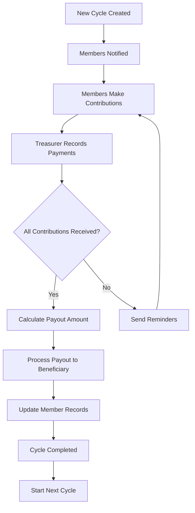

# 🏦 Chama Smart - Digital Table Banking System

[](https://www.djangoproject.com/)
[](https://www.python.org/)
[]()

A professional, production-ready Django application for managing Chama (Merry-Go-Round/Table Banking) groups in Kenya and East Africa. Built with security, scalability, and modern financial management practices in mind.

## 🎯 Key Features

### 💰 **Financial Management**
- **Contribution Tracking**: Automated cycle-based contribution collection
- **Merry-Go-Round Rotation**: Smart payout queue management
- **Loan Management**: Member loans with interest calculation and guarantors
- **Payment Integration**: M-Pesa, Bank Transfers, Cash, and Card payments
- **Late Payment Penalties**: Automatic calculation and tracking
- **Financial Reports**: Comprehensive analytics and export capabilities

### 👥 **Member Management**
- **Multi-Role System**: Admin, Treasurer, Secretary, and Member roles
- **KYC Compliance**: National ID verification and profile management
- **Membership Tracking**: Position in rotation, contribution history
- **Two-Factor Authentication**: Enhanced security for sensitive operations

### 📊 **Meetings & Governance**
- **Meeting Scheduling**: Automated reminders and calendar integration
- **Attendance Tracking**: Real-time attendance monitoring
- **Minutes Recording**: Digital meeting minutes and agenda management
- **Member Voting**: Decision tracking and member consensus

### 🔔 **Communication**
- **Multi-Channel Notifications**: SMS, Email, Push, and In-App
- **Automated Reminders**: Contribution deadlines, meeting alerts
- **Transaction Updates**: Real-time payment confirmations
- **Custom Alerts**: Configurable notification preferences

### 🔐 **Security & Compliance**
- **Audit Trail**: Complete activity logging for compliance
- **Role-Based Access Control**: Granular permissions management
- **Data Encryption**: Secure sensitive information storage
- **Banking Integration**: Secure API connections with financial institutions

---

## 🚀 Quick Start

### Prerequisites

```bash
# System Requirements
Python 3.10+
PostgreSQL 13+ (or SQLite for development)
Redis (optional, for caching)
```

### Installation

1. **Clone the repository**
```bash
git clone https://github.com/yourusername/chama-smart.git
cd chama-smart
```

2. **Create virtual environment**
```bash
python -m venv venv
source venv/bin/activate  # On Windows: venv\Scripts\activate
```

3. **Install dependencies**
```bash
pip install -r requirements.txt
```

4. **Environment Configuration**
```bash
# Create .env file
cp .env.example .env

# Edit .env with your settings
nano .env
```

5. **Database Setup**
```bash
# Run migrations
python manage.py makemigrations main_application
python manage.py migrate

# Create superuser
python manage.py createsuperuser
```

6. **Run Development Server**
```bash
python manage.py runserver
```

Visit `http://127.0.0.1:8000/admin/` to access the admin panel.

---

## 📁 Project Structure

```
chama-smart/
├── main_application/
│   ├── models.py           # Database models
│   ├── admin.py            # Admin interface configuration
│   ├── views.py            # API views and logic
│   ├── serializers.py      # DRF serializers
│   ├── urls.py             # URL routing
│   ├── signals.py          # Django signals
│   ├── permissions.py      # Custom permissions
│   ├── utils.py            # Utility functions
│   ├── tasks.py            # Celery tasks (async)
│   └── migrations/         # Database migrations
├── config/
│   ├── settings.py         # Django settings
│   ├── urls.py             # Main URL configuration
│   └── wsgi.py             # WSGI configuration
├── static/                 # Static files (CSS, JS, images)
├── media/                  # User uploads
├── templates/              # HTML templates
├── requirements.txt        # Python dependencies
├── .env.example           # Environment variables template
├── manage.py              # Django management script
└── README.md              # This file
```

---

## 🔧 Configuration

### Environment Variables

Create a `.env` file in the project root:

```env
# Django Settings
SECRET_KEY=your-secret-key-here
DEBUG=True
ALLOWED_HOSTS=localhost,127.0.0.1

# Database
DB_ENGINE=django.db.backends.postgresql
DB_NAME=chama_smart_db
DB_USER=postgres
DB_PASSWORD=your_password
DB_HOST=localhost
DB_PORT=5432

# M-Pesa Daraja API
MPESA_ENVIRONMENT=sandbox  # or production
MPESA_CONSUMER_KEY=your_consumer_key
MPESA_CONSUMER_SECRET=your_consumer_secret
MPESA_SHORTCODE=your_paybill_number
MPESA_PASSKEY=your_passkey
MPESA_INITIATOR_NAME=your_initiator_name
MPESA_SECURITY_CREDENTIAL=your_credential

# SMS Configuration (Africa's Talking)
AT_USERNAME=your_username
AT_API_KEY=your_api_key
AT_SENDER_ID=CHAMASMART

# Email Configuration
EMAIL_BACKEND=django.core.mail.backends.smtp.EmailBackend
EMAIL_HOST=smtp.gmail.com
EMAIL_PORT=587
EMAIL_USE_TLS=True
EMAIL_HOST_USER=your_email@gmail.com
EMAIL_HOST_PASSWORD=your_app_password

# Redis (for caching and Celery)
REDIS_URL=redis://localhost:6379/0

# Security
SECURE_SSL_REDIRECT=False  # Set True in production
SESSION_COOKIE_SECURE=False  # Set True in production
CSRF_COOKIE_SECURE=False  # Set True in production
```

---

## 📦 Dependencies

### Core Requirements

```txt
# requirements.txt
Django==4.2.7
djangorestframework==3.14.0
psycopg2-binary==2.9.9
python-decouple==3.8
Pillow==10.1.0
django-cors-headers==4.3.1

# Payment Integration
requests==2.31.0
python-mpesa==1.2.0

# SMS
africastalking==1.2.5

# Task Queue
celery==5.3.4
redis==5.0.1

# API Documentation
drf-yasg==1.21.7

# Security
django-ratelimit==4.1.0
django-axes==6.1.1

# Monitoring
sentry-sdk==1.39.1

# Testing
pytest==7.4.3
pytest-django==4.7.0
factory-boy==3.3.0
faker==20.1.0
```

---

## 🎨 Admin Interface

The admin panel (`/admin/`) provides a comprehensive interface for managing:

### Dashboard Features
- **Chama Overview**: Active groups, total contributions, member statistics
- **Financial Summary**: Real-time financial metrics and reports
- **Member Management**: User profiles, roles, and verification status
- **Contribution Tracking**: Cycle progress, payment status
- **Loan Management**: Application approval, repayment tracking
- **Meeting Management**: Schedule, attendance, minutes
- **Notification Center**: Send bulk messages, view notification history
- **Audit Logs**: Complete system activity tracking

### Custom Admin Actions
- Bulk approve/reject loans
- Export financial reports (PDF/Excel)
- Send notifications to selected members
- Generate contribution reminders
- Mark contributions as paid
- Process payouts

---

## 🔐 User Roles & Permissions

### Administrator
- Full system access
- Create and manage Chamas
- Approve loans and payouts
- View all financial reports
- Manage system settings

### Treasurer
- Record contributions
- Process payments
- Generate financial reports
- Manage loan applications
- Track member balances

### Secretary
- Record meeting minutes
- Track attendance
- Send notifications
- Manage member communications

### Member
- View personal contribution history
- Apply for loans
- Check payout schedule
- View meeting schedules
- Receive notifications

---

## 🔄 Workflow Examples

### 1. Contribution Cycle Flow



### 2. Loan Application Flow

```python
# Example: Loan Application Process
1. Member submits loan application
2. System validates eligibility
3. Guarantors receive notification
4. Guarantors accept/decline
5. Admin/Treasurer reviews application
6. Loan approved/rejected
7. If approved: Funds disbursed
8. Repayment schedule created
9. Monthly reminders sent
10. Track repayments until completion
```

---

## 📊 API Endpoints

### Authentication
```
POST   /api/auth/register/          - Register new user
POST   /api/auth/login/             - Login
POST   /api/auth/logout/            - Logout
POST   /api/auth/password-reset/    - Password reset
```

### Chamas
```
GET    /api/chamas/                 - List all chamas
POST   /api/chamas/                 - Create chama
GET    /api/chamas/{id}/            - Chama details
PUT    /api/chamas/{id}/            - Update chama
DELETE /api/chamas/{id}/            - Delete chama
GET    /api/chamas/{id}/members/    - List members
GET    /api/chamas/{id}/stats/      - Financial statistics
```

### Contributions
```
GET    /api/contributions/          - List contributions
POST   /api/contributions/          - Record contribution
GET    /api/contributions/{id}/     - Contribution details
PUT    /api/contributions/{id}/     - Update contribution
```

### Loans
```
GET    /api/loans/                  - List loans
POST   /api/loans/                  - Apply for loan
GET    /api/loans/{id}/             - Loan details
POST   /api/loans/{id}/approve/     - Approve loan
POST   /api/loans/{id}/disburse/    - Disburse funds
POST   /api/loans/{id}/repay/       - Record repayment
```

### Payouts
```
GET    /api/payouts/                - List payouts
POST   /api/payouts/                - Create payout
POST   /api/payouts/{id}/approve/   - Approve payout
POST   /api/payouts/{id}/process/   - Process payout
```

### Meetings
```
GET    /api/meetings/               - List meetings
POST   /api/meetings/               - Schedule meeting
GET    /api/meetings/{id}/          - Meeting details
POST   /api/meetings/{id}/attendance/ - Mark attendance
```

---

## 🧪 Testing

### Run Tests
```bash
# Run all tests
python manage.py test

# Run specific app tests
python manage.py test main_application

# Run with coverage
coverage run --source='.' manage.py test
coverage report
coverage html
```

### Sample Test
```python
from django.test import TestCase
from main_application.models import Chama, User

class ChamaTestCase(TestCase):
    def setUp(self):
        self.user = User.objects.create_user(
            username='testuser',
            email='test@example.com',
            phone_number='254712345678'
        )
        
    def test_chama_creation(self):
        chama = Chama.objects.create(
            name='Test Chama',
            contribution_amount=1000,
            contribution_frequency='MONTHLY',
            created_by=self.user
        )
        self.assertEqual(chama.name, 'Test Chama')
        self.assertEqual(chama.total_members, 0)
```

---

## 🚀 Deployment

### Production Checklist

- [ ] Set `DEBUG=False` in production
- [ ] Configure proper `SECRET_KEY`
- [ ] Set up PostgreSQL database
- [ ] Configure Redis for caching
- [ ] Set up Celery for async tasks
- [ ] Configure Gunicorn/uWSGI
- [ ] Set up Nginx reverse proxy
- [ ] Enable HTTPS/SSL certificates
- [ ] Configure static files serving
- [ ] Set up automated backups
- [ ] Configure monitoring (Sentry)
- [ ] Set up log management
- [ ] Configure firewall rules

### Docker Deployment

```dockerfile
# Dockerfile
FROM python:3.10-slim

WORKDIR /app

COPY requirements.txt .
RUN pip install --no-cache-dir -r requirements.txt

COPY . .

RUN python manage.py collectstatic --noinput

CMD ["gunicorn", "config.wsgi:application", "--bind", "0.0.0.0:8000"]
```

```yaml
# docker-compose.yml
version: '3.8'

services:
  db:
    image: postgres:13
    environment:
      POSTGRES_DB: chama_smart_db
      POSTGRES_USER: postgres
      POSTGRES_PASSWORD: your_password
    volumes:
      - postgres_data:/var/lib/postgresql/data

  redis:
    image: redis:7-alpine

  web:
    build: .
    command: gunicorn config.wsgi:application --bind 0.0.0.0:8000
    volumes:
      - ./:/app
      - static_volume:/app/staticfiles
      - media_volume:/app/media
    ports:
      - "8000:8000"
    depends_on:
      - db
      - redis
    env_file:
      - .env

  celery:
    build: .
    command: celery -A config worker -l info
    volumes:
      - ./:/app
    depends_on:
      - db
      - redis
    env_file:
      - .env

volumes:
  postgres_data:
  static_volume:
  media_volume:
```

---

## 📱 M-Pesa Integration

### STK Push (Lipa Na M-Pesa)

```python
from mpesa import MpesaClient

def initiate_stk_push(phone_number, amount, account_reference):
    """
    Initiate M-Pesa STK Push for contribution payment
    """
    client = MpesaClient()
    response = client.stk_push(
        phone_number=phone_number,
        amount=amount,
        account_reference=account_reference,
        transaction_desc='Chama Contribution'
    )
    return response
```

### Callback Handling

```python
from django.views.decorators.csrf import csrf_exempt
from django.http import JsonResponse
import json

@csrf_exempt
def mpesa_callback(request):
    """
    Handle M-Pesa payment callbacks
    """
    if request.method == 'POST':
        data = json.loads(request.body)
        # Process payment confirmation
        # Update contribution status
        return JsonResponse({'ResultCode': 0, 'ResultDesc': 'Success'})
```

---

## 📈 Performance Optimization

### Database Indexing
All critical fields are indexed for optimal query performance:
- User lookups (phone, email)
- Contribution queries (date, status)
- Financial calculations
- Search operations

### Caching Strategy
```python
# settings.py
CACHES = {
    'default': {
        'BACKEND': 'django_redis.cache.RedisCache',
        'LOCATION': 'redis://127.0.0.1:6379/1',
    }
}

# Use in views
from django.core.cache import cache

def get_chama_stats(chama_id):
    cache_key = f'chama_stats_{chama_id}'
    stats = cache.get(cache_key)
    
    if not stats:
        stats = calculate_stats(chama_id)
        cache.set(cache_key, stats, 3600)  # Cache for 1 hour
    
    return stats
```

---

## 🐛 Troubleshooting

### Common Issues

**Issue**: Database connection error
```bash
# Solution: Check PostgreSQL is running
sudo service postgresql status
sudo service postgresql start
```

**Issue**: M-Pesa integration fails
```bash
# Solution: Verify credentials in .env
# Check sandbox vs production environment
# Verify callback URL is accessible
```

**Issue**: Static files not loading
```bash
# Solution: Collect static files
python manage.py collectstatic --clear
python manage.py collectstatic
```

---

## 📚 Documentation

- [Django Documentation](https://docs.djangoproject.com/)
- [Django REST Framework](https://www.django-rest-framework.org/)
- [M-Pesa Daraja API](https://developer.safaricom.co.ke/)
- [Africa's Talking SMS](https://developers.africastalking.com/)

---

## 🤝 Contributing

We welcome contributions! Please follow these steps:

1. Fork the repository
2. Create a feature branch (`git checkout -b feature/AmazingFeature`)
3. Commit your changes (`git commit -m 'Add some AmazingFeature'`)
4. Push to the branch (`git push origin feature/AmazingFeature`)
5. Open a Pull Request

### Code Standards
- Follow PEP 8 style guide
- Write comprehensive tests
- Document all functions and classes
- Keep commits atomic and well-described

---

## 📄 License

This is proprietary software. All rights reserved.

**Copyright © 2025 Chama Smart**

For licensing inquiries, contact: licensing@chamasmart.com

---

## 📞 Support

- **Email**: support@chamasmart.com
- **Documentation**: https://docs.chamasmart.com
- **Issue Tracker**: https://github.com/yourusername/chama-smart/issues
- **WhatsApp Support**: +254 XXX XXX XXX

---

## 🎉 Acknowledgments

- Built with Django and Django REST Framework
- Inspired by traditional Kenyan Chama practices
- Special thanks to the open-source community

---

## 🗺️ Roadmap

### Version 1.1 (Q1 2025)
- [ ] Mobile app (iOS/Android)
- [ ] Advanced analytics dashboard
- [ ] Automated tax reporting
- [ ] Multi-currency support

### Version 1.2 (Q2 2025)
- [ ] Investment tracking module
- [ ] Integration with equity platforms
- [ ] Smart contract integration
- [ ] AI-powered financial insights

### Version 2.0 (Q3 2025)
- [ ] Blockchain-based transparency
- [ ] DeFi integration
- [ ] International expansion
- [ ] White-label solution

---

**Made by Steve Ongera | 0112284093 in Kenya**